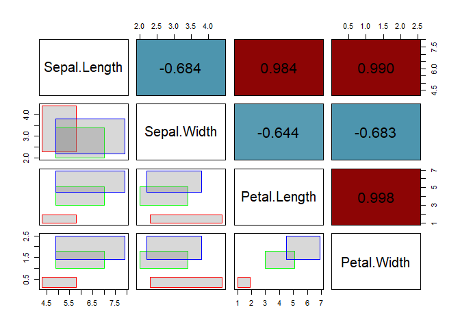

# AIDA: Analysis of Interval DAta

<!-- badges: start -->

[](https://github.com/catarinaploureiro/AIDA/actions/workflows/R-CMD-check.yaml)
[](https://CRAN.R-project.org/package=AIDA)
[](https://cran.r-project.org/web/checks/check_results_AIDA.html)
[](https://github.com/catarinaploureiro/AIDA)
[](https://app.codecov.io/gh/catarinaploureiro/AIDA)
[](LICENSE)
[](https://arxiv.org/abs/2604.26769)
[](https://arxiv.org/abs/2606.26307)
<!-- badges: end -->

## Overview

**AIDA** provides tools for the analysis of interval-valued data,
including construction, visualization, robust estimation, and outlier
detection. The R package is built around the `intData` class and is
designed to support methodological research and applied workflows
involving interval-valued data.

AIDA currently includes functionality for:

- Construction of interval-valued datasets
- Interval-valued covariance estimation based on Mallows distance
- Interval Minimum Covariance Determinant (IMCD) estimator
- Robust squared Interval-Mahalanobis distance
- Outlier detection based on robust distances
- Explainable outlier detection using Shapley values
- Visualization tools for interval data

## Installation

You can install the development version from GitHub:

``` r
# install.packages("pak")
pak::pak("catarinaploureiro/AIDA")
```

## Minimal Example

``` r
library(AIDA)
#> 
#> Attaching package: 'AIDA'
#> The following object is masked from 'package:base':
#> 
#>     rbind

# Create an intData object from the iris dataset, using the Species column as 
# grouping variable. We also specify the latent distribution as "General" to 
# estimate the parameters based on the microdata.
data(iris)
iris_int <- micro2intData(iris[,1:4], iris$Species, LatentCase = "General")

# Check the parameters of the latent distribution
iris_int@LatentParam
#> [[1]]
#>           [,1]      [,2]      [,3]      [,4]
#> [1,] 0.1835903 0.1554921 0.1660354 0.1990067
#> [2,] 0.1554921 0.1381013 0.1461729 0.1683492
#> [3,] 0.1660354 0.1461729 0.1627440 0.1828199
#> [4,] 0.1990067 0.1683492 0.1828199 0.2704900
#> 
#> [[2]]
#>            [,1]       [,2]       [,3]       [,4]
#> [1,] 0.01851852 0.00000000 0.00000000  0.0000000
#> [2,] 0.00000000 0.04199507 0.00000000  0.0000000
#> [3,] 0.00000000 0.00000000 0.02913753  0.0000000
#> [4,] 0.00000000 0.00000000 0.00000000 -0.1802821

# Compute the classical covariance and correlation matrices
iris_cov <- int_cov(iris_int)
iris_corr <- cov2cor(iris_cov)

# Pairs plot, the lower triangular shows scatter plots of the four variables, 
# while the upper triangular shows the interval correlation matrix.
plot_pairs_int(iris_int, corr = iris_corr, labels = colnames(iris_int))
```



## Vignettes

For a full introduction about the `intData` class (Oliveira, Pinheiro,
and Oliveira (2025)), see:

``` r
vignette("intData_examples", package = "AIDA")
```

For examples on the IMCD estimator and outlier detection based on the
robust squared Interval-Mahalanobis distance (Loureiro et al. (2026b)),
see:

``` r
vignette("IMCD_examples", package = "AIDA")
```

For examples on explainable outlier detection using Shapley values
(Loureiro et al. (2026a)), see:

``` r
vignette("Shapley_examples", package = "AIDA")
```

## References

<div id="refs" class="references csl-bib-body hanging-indent"
entry-spacing="0">

<div id="ref-loureiro2026b" class="csl-entry">

Loureiro, Catarina P., M. Rosário Oliveira, Paula Brito, and Lina
Oliveira. 2026a. “<span class="nocase">Explainable Outlier Detection for
Interval-valued Data</span>.” <https://arxiv.org/abs/2606.26307>.

</div>

<div id="ref-loureiro2026" class="csl-entry">

———. 2026b. “<span class="nocase">Minimum Covariance Determinant
Estimator and Outlier Detection for Interval-valued Data</span>.”
<https://arxiv.org/abs/2604.26769>.

</div>

<div id="ref-oliveira2025" class="csl-entry">

Oliveira, M. Rosário, Diogo Pinheiro, and Lina Oliveira. 2025.
“<span class="nocase">Location and association measures for interval
data based on Mallows distance</span>.”
<https://arxiv.org/abs/2407.05105>.

</div>

</div>
